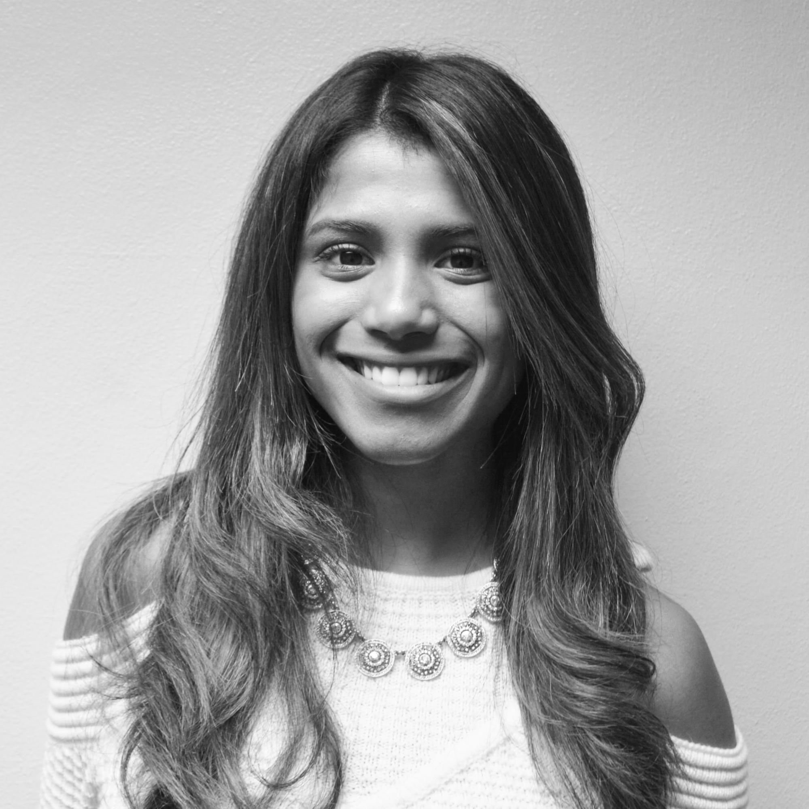
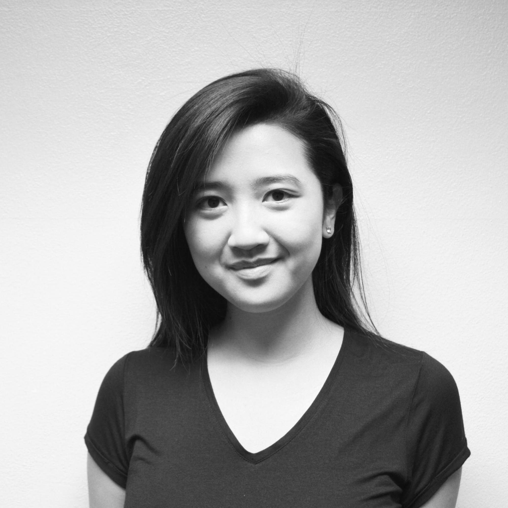
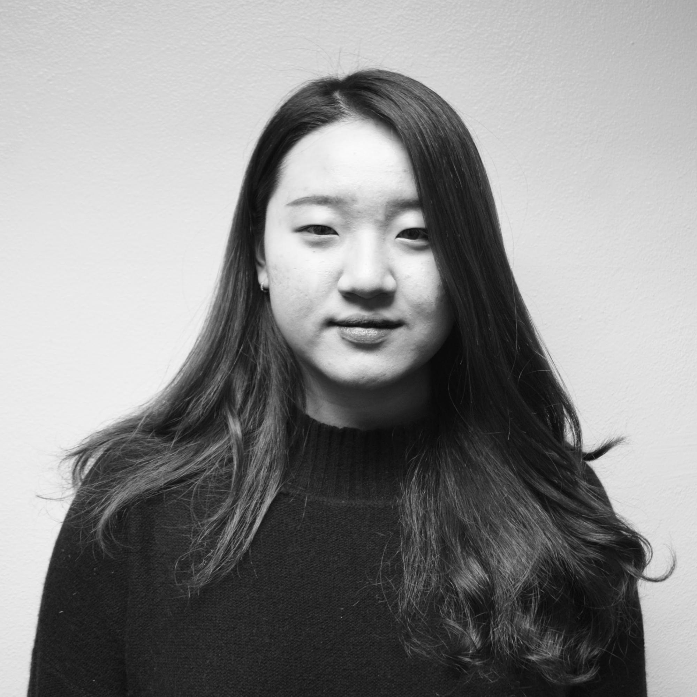
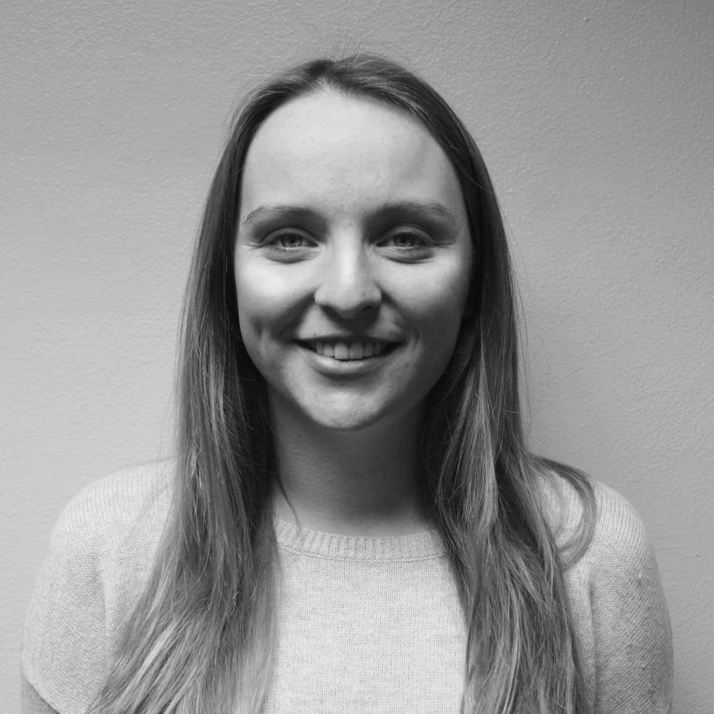
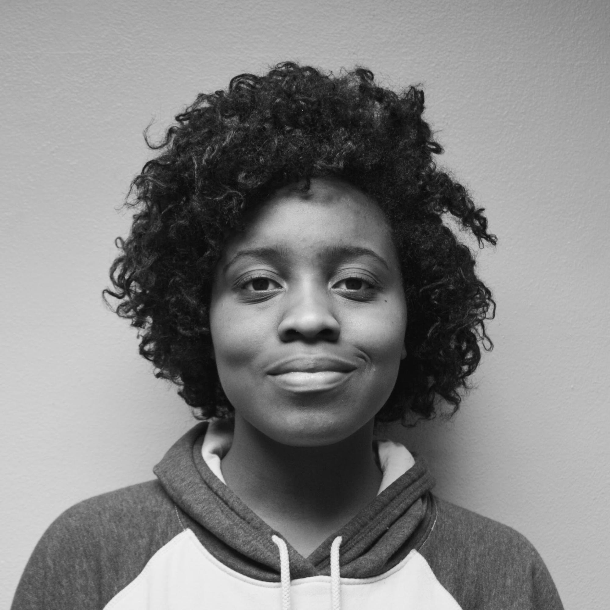
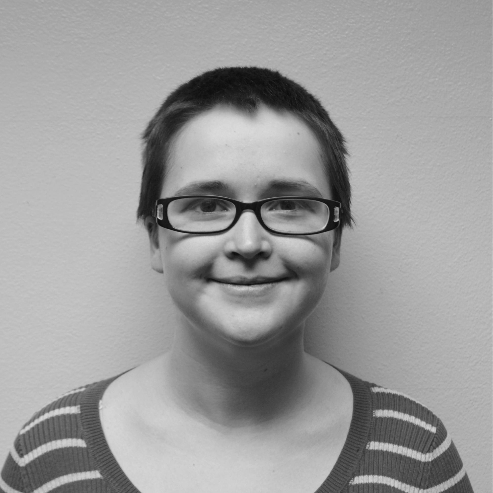
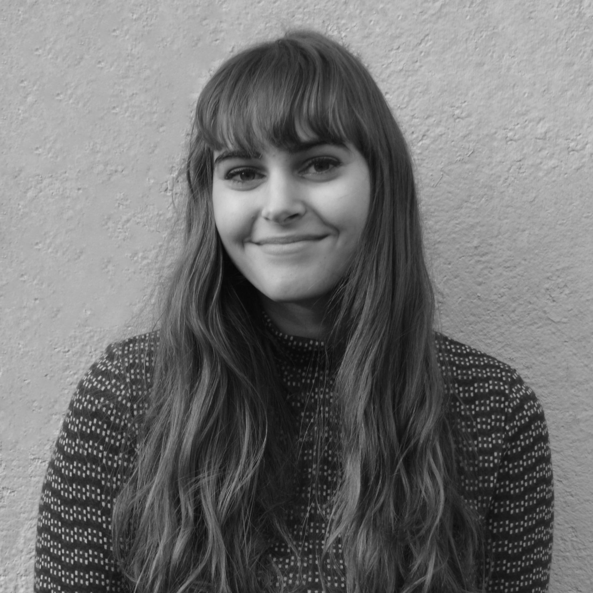
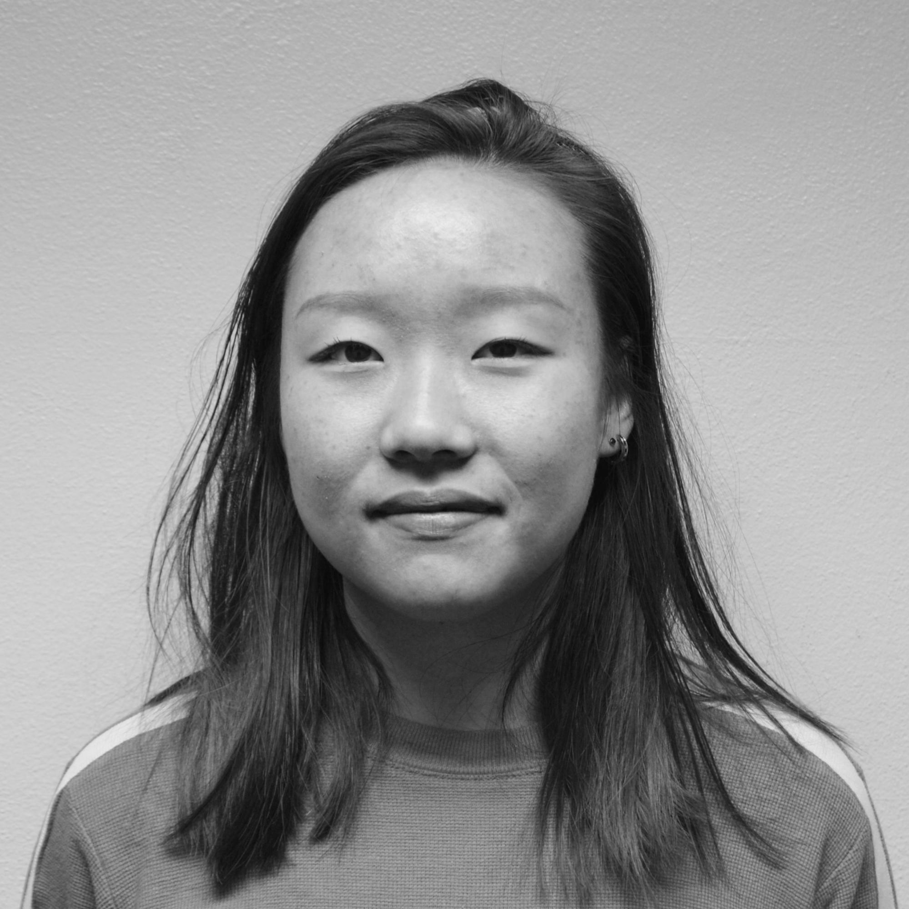
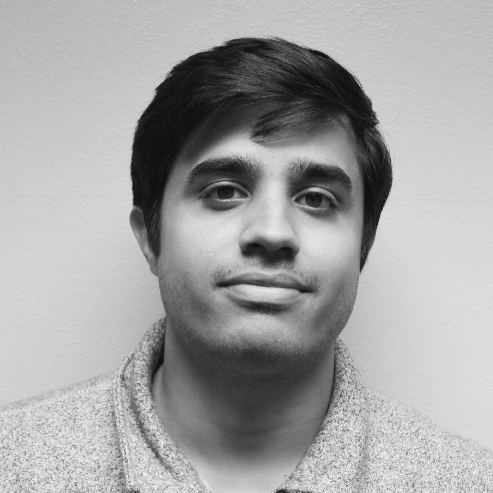
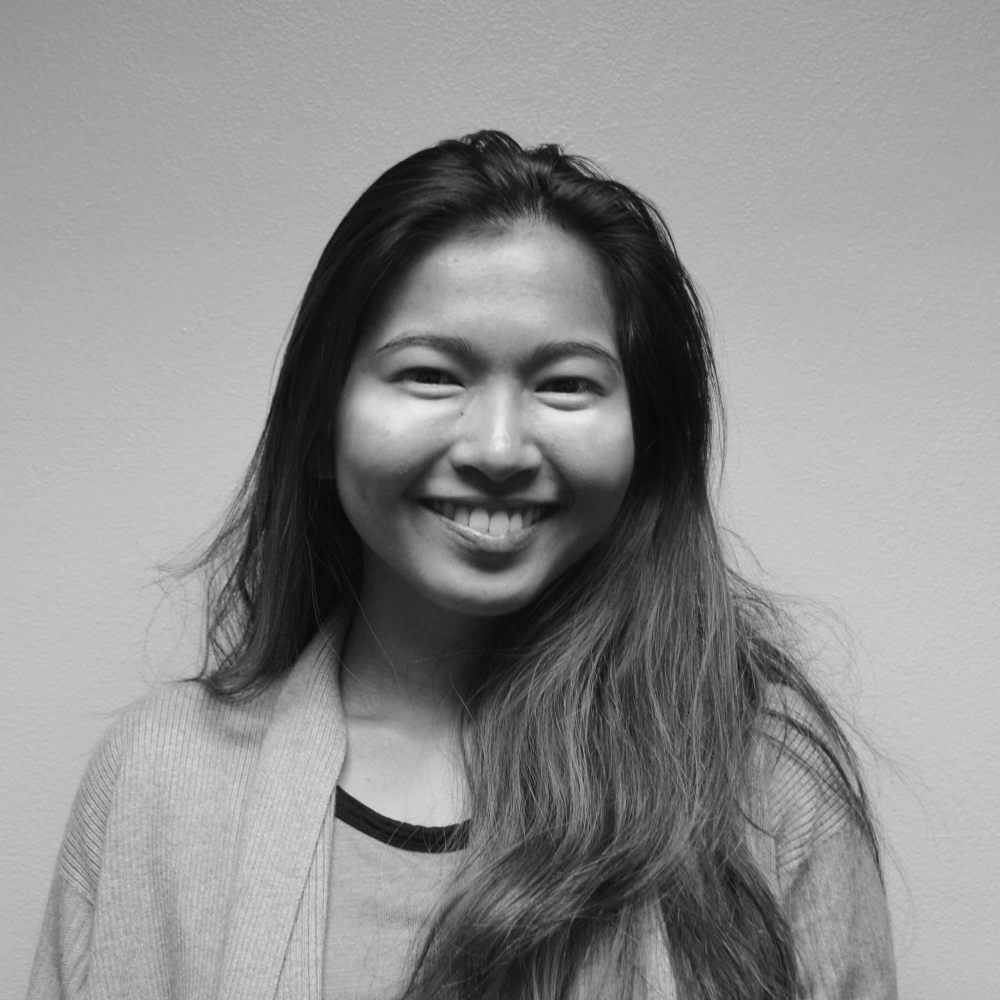

+++
date = "2016-11-05 21:05:33+05:30"
title = "About"
+++

We are Consider, a point/counter-point publication.

Meet some of our team members!

#### President: Samantha Wintner

Sam is the president and editor in chief of Consider! She is a senior in the Ford School concentrating her policy studies in international economics and development, and minoring in political science. She loves to travel and spent the Winter 2016 semester studying abroad in London, United Kingdom.

#### Vice President: Sara Ramaswamy

Hailing from New Jersey, Sara is the vice president of Consider! She is a sophomore interested in pursuing communications and information science. Her motivation is her future corgi.

#### Alyssa Sutanto

Alyssa is a member of the marketing team! She is a freshman in LSA interested in communications and organizational studies. She is an Indonesian international student who is currently over 9,000 miles away from home and is loving life in Ann Arbor.

#### Min Jeong Kim

Min Jeong is a member of the design team! Hailing from Hong Kong, she is pursuing a degree in Stamps, specifically in graphic design. Although she is Korean, Min Jeong was born in Shanghai and attended international school in both Shanghai and Hong Kong.

#### Kirsty McInnes

Kirsty is a member of the publication team. She is pursuing a degree in communications and hoping to minor in writing. She is a member of Pi Beta Phi and loves hiking in Scotland.

#### Alyson Grigsby

Alyson is a member of the publication team! She is a first year student interested in pursuing a major in political science and a minor in intergroup relations, and is really passionate about social justice.

#### Katyanna Guthrie

Katyanna is a member of the publication team. She is pursuing a degree in psychology and English in LSA. She is a cat hoarder and owns three rescued cats.

#### Kelsi Franzino

Kelsi is Design Director for Consider. She is an Art & Design Senior from Connecticut, and eats salsa with a spoon.

#### Rinette Korea

Rinette is a member of the design team. She is in the School of Art and Design and is currently pursuing a degree in fine arts with an economics minor. Her last name is also the name of a country.

#### Adam Trosin

Adam is a member of the development team and a junior studying economics in LSA. He is from Jackson, Michigan and is the undisputed tallest member of the Consider team.

#### Farhad Hussain

Farhad is Consider’s Director of Development and a double-major in business and economics, in both Ross and LSA. He is from Bloomfield Hills, Michigan and has a killer three-point shot (put him on any IM team).

#### Linda Sun

Linda is a member of the marketing team! She is a Brooklynite and a sophomore interested in pursuing information science and economics. She is hypermobile and can fake a broken arm.
